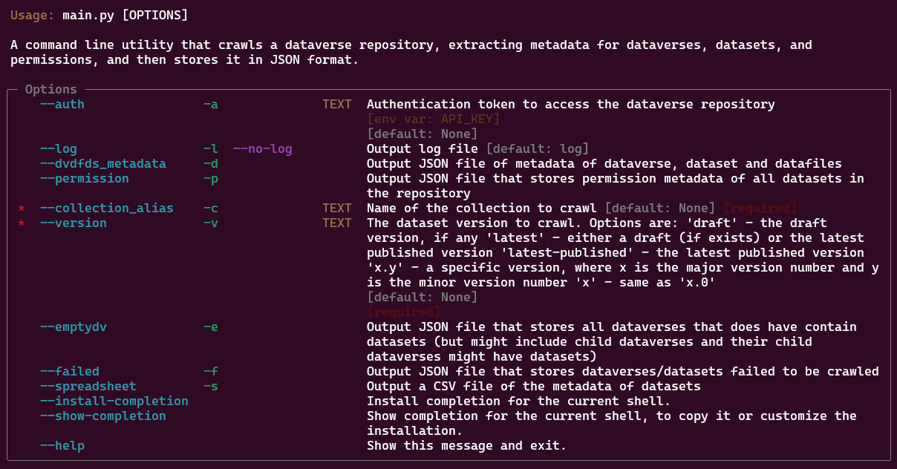

[](https://www.repostatus.org/#active)
[](https://opensource.org/license/mit)
[](https://dataverse.org/)
[](https://github.com/psf/black)

# Dataverse Metadata Crawler


## 📜Description
A Python CLI tool for extracting and exporting metadata from [Dataverse](https://dataverse.org/) repositories. It supports bulk extraction of dataverses, datasets, and data file metadata from any chosen level of dataverse collection (whole Dataverse repository/sub-Dataverse), with flexible export options to JSON and CSV formats.

## ✨Features
1. Bulk metadata extraction from Dataverse repositories from any chosen level of collection (top level or selected collection)
2. JSON & CSV file export options

## 📦Prerequisites
1. Git
2. Python 3.10+

## ⚙️Installation

1. Clone the repository
   ```sh
   git clone https://github.com/scholarsportal/dataverse-metadata-crawler.git
   ```

2. Change to the project directory
   ```sh
   cd ~/dataverse-metadata-export-p
   ```

3. Create an environment file (.env)
   ```sh
   touch .env  # For Unix/MacOS
   nano .env   # or vim .env, or your preferred editor
   # OR
   New-Item .env -Type File   # For Windows (Powershell)
   notepad .env
   ```

4. Configure environment file using your text editor at your choice
   ```sh
   # .env file
   BASE_URL = "TARGET_REPO_URL"  # e.g., "https://demo.borealisdata.ca/"
   API_KEY = "YOUR_API_KEY"      # Find in your Dataverse account settings. You may also specify it in the CLI interface (with -a flag)
   ```

5. Set up virtual environment (recommended)
   ```sh
   python3 -m venv .venv
   source .venv/bin/activate     # For Unix/MacOS
   # OR
   .venv\Scripts\activate       # For Windows
   ```

6. Install dependencies
   ```sh
   pip install -r requirements.txt
   ```

## 🛠️Usage

### Basic Command
```sh
python3 dvmeta/main.py [-a AUTH] [-l] [-d] [-p] [-f] [-e] [-s] -c COLLECTION_ALIAS -v VERSION
```
**Required arguments:**
| **Option**         | **Short** | **Type** | **Description**                                                                                                                                                                                                                                                                            | **Default**     |
|--------------------|-----------|----------|--------------------------------------------------------------------------------------------------------------------------------------------------------------------------------------------------------------------------------------------------------------------------------------------|-----------------|
| --collection_alias | -c        | TEXT     | Name of the collection to crawl. <br/> **[required]**                                                                                                                                                                                                                                      | None            |
| --version          | -v        | TEXT     | The Dataset version to crawl. Options include: <br/> • `draft` - The draft version, if any <br/> • `latest` - Either a draft (if exists) or the latest published version <br/> • `latest-published` - The latest published version <br/> • `x.y` - A specific version <br/> **[required]** | None (required) |


**Optional arguments:**
| **Option**           | **Short** | **Type** | **Description**                                                                                                                                                                                                                                                                            | **Default**               |
|----------------------|-----------|----------|--------------------------------------------------------------------------------------------------------------------------------------------------------------------------------------------------------------------------------------------------------------------------------------------|---------------------------|
| --auth               | -a        | TEXT     | Authentication token to access the Dataverse repository. <br/> If                                                                                                                                                                                                          | None                      |
| --log <br/> --no-log | -l        |          | Output a log file. <br/> Use `--no-log` to disable logging.                                                                                                                                                                                                      | `log` (unless `--no-log`) |
| --dvdfds_metadata    | -d        |          | Output a JSON file containing metadata of Dataverses, Datasets, and Data Files.                                                                                                                                                                                                             |                           |
| --permission         | -p        |          | Output a JSON file that stores permission metadata for all Datasets in the repository.                                                                                                                                                                                                     |                           |
| --emptydv            | -e        |          | Output a JSON file that stores all Dataverses which do **not** contain Datasets (though they might have child Dataverses which have Datasets).                                                                                                                                             |                           |
| --failed             | -f        |          | Output a JSON file of Dataverses/Datasets that failed to be crawled.                                                                                                                                                                                                                       |                           |
| --spreadsheet        | -s        |          | Output a CSV file of the metadata of Datasets.                                                                                                                                                                                                                                             |                           |
| --help               |           |          | Show the help message.                                                                                                                                                                                                                                                                |                           |

### Examples
```sh
# Export the metadata of latest version of datasets under collection 'demo' to JSON
python3 dvmeta/main.py -c demo -v latest -d

# Export the metadata of version 1.0 of all datasets under collection 'demo' to JSON and CSV
python3 dvmeta/main.py -c demo -v 1.0 -d -s

# Export the metadata and permission metadata of version 1.0 of all datasets under collection 'demo' to JSON and CSV, with the API token specified in the CLI interface
python3 dvmeta/main.py -c demo -v 1.0 -d -s -p -a xxxxxxxx-xxxx-xxxx-xxxx-xxxxxxxx
```

## 📂Output Structure
| File                                      | Description                                                                                                                             |
|-------------------------------------------|-----------------------------------------------------------------------------------------------------------------------------------------|
| ds_metadata_yyyymmdd-HHMMSS.json          | Datasets' their data files' metadata in JSON format.                                                                                    |
| empty_dv_yyyymmdd-HHMMSS.json             | The id of empty dataverse(s) in list format.                                                                                            |
| failed_metadata_uris_yyyymmdd-HHMMSS.json | The URIs (URL) of datasets failed to be downloaded.                                                                                     |
| permission_dict_yyyymmdd-HHMMSS.json      | The perission metadata of datasets with their dataset id.                                                                               |
| pid_dict_yyyymmdd-HHMMSS.json             | Datasets' basic info with hierarchical information dictionary.Only exported if -p (permission) flag is used without -d (metadata) flag. |
| pid_dict_dd_yyyymmdd-HHMMSS.json          | The Hierarchical information of deaccessioned/draft datasets.                                                                           |
| ds_metadata_yyyymmdd-HHMMSS.csv           | Datasets' their data files' metadata in CSV format.                                                                                     |
| log_yyyymmdd-HHMMSS.txt                   | Summary of the crawling work.                                                                                                           |

```sh
exported_files/
├── json_files/
│   └── ds_metadata_yyyymmdd-HHMMSS.json # With -d flag enabled
│   └── empty_dv_yyyymmdd-HHMMSS.json # With -e flag enabled
│   └── failed_metadata_uris_yyyymmdd-HHMMSS.json 
│   └── permission_dict_yyyymmdd-HHMMSS.json # With -p flag enabled
│   └── pid_dict_yyyymmdd-HHMMSS.json # Only exported if -p flag is used without -d flag
│   └── pid_dict_dd_yyyymmdd-HHMMSS.json # Hierarchical information of deaccessioned/draft datasets
├── csv_files/
│   └── ds_metadata_yyyymmdd-HHMMSS.csv # with -s flag enabled
└── logs_files/
    └── log_yyyymmdd-HHMMSS.txt # Exported by default, without specifying --no-log
```

## ✅Tests
No tests have been written yet. Contributions welcome!

## 💻Development
1. Dependencies managment: [poetry](https://python-poetry.org/) - Update the pyproject.toml dependencies changes
2. Linter: [ruff](https://docs.astral.sh/ruff/) - Linting rules are outlined in the pyproject.toml

## 🙌Contributing
1. Fork the repository
2. Create a feature branch
3. Submit a pull request

## 📄License
[MIT](https://choosealicense.com/licenses/mit/)

## 🆘Support
- Create an issue in the GitHub repository

## 📚Citation
If you use this software in your work, please cite it using the following metadata.

APA:
```
Lui, L. H. (2025). Dataverse metadata Crawler (Version 0.1.0) [Computer software]. https://github.com/kenlhlui/dataverse-metadata-crawler-p
```

BibTeX:
```
@software{Lui_Dataverse_metadata_Crawler_2025,
author = {Lui, Lok Hei},
month = jan,
title = {{Dataverse metadata Crawler}},
url = {https://github.com/kenlhlui/dataverse-metadata-crawler-p},
version = {0.1.0},
year = {2025}
}
```

## ✍️Authors
Ken Lui - Data Curation Specialist, Map and Data Library, University of Toronto - kenlh.lui@utoronto.ca

