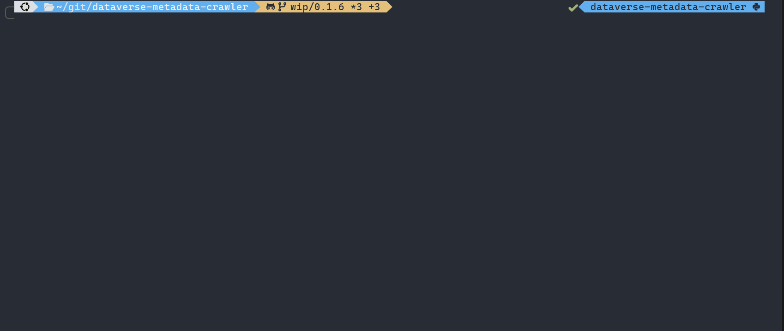

[](https://www.repostatus.org/#active)
[](https://opensource.org/license/mit)
[](https://dataverse.org/)
[](https://mybinder.org/v2/gh/scholarsportal/dataverse-metadata-crawler/main?urlpath=%2Fdoc%2Ftree%2Fcloud_cli.ipynb)

# Dataverse Metadata Crawler



## 📜Description

A Python CLI tool for extracting and exporting metadata from [Dataverse](https://dataverse.org/) repositories. It supports bulk extraction of dataverses, datasets, and data file metadata from any chosen level of dataverse collection (an entire Dataverse repository/sub-Dataverse), with flexible export options to JSON and CSV formats.

## ✨Features

1. Bulk metadata extraction from Dataverse repositories at any chosen level of collection (top level or selected collection)
2. JSON & CSV file export options

## ☁️ Installation (Cloud - Slower)

Click
[](https://mybinder.org/v2/gh/scholarsportal/dataverse-metadata-crawler/main?urlpath=%2Fdoc%2Ftree%2Fcloud_cli.ipynb)
to launch the crawler directly in your web browser—no Git or Python installation required!

## ⚙️Installation (Locally - Better performance)

### 📦Prerequisites

1. [Git](https://git-scm.com/)
2. [Python 3.11+](https://www.python.org/)

---

1. Clone the repository

   ```sh
   git clone https://github.com/scholarsportal/dataverse-metadata-crawler.git
   ```

2. Change to the project directory

   ```sh
   cd ./dataverse-metadata-crawler
   ```

3. Create an environment file (`.env`)

   ```sh
   touch .env  # For Unix/MacOS
   nano .env   # or vim .env, or your preferred editor
   # OR
   New-Item .env -Type File   # For Windows (Powershell)
   notepad .env
   ```

4. Configure the environment (`.env`) file using the text editor of your choice.

   ```sh
   # .env file
   BASE_URL = "TARGET_REPO_URL"  # Base URL of the repository; e.g., "https://demo.borealisdata.ca/"
   API_TOKEN = "YOUR_API_TOKEN"      # Found in your Dataverse account settings. Can also be specified in the CLI interface using the -a flag.
   ```

   Your `.env` file should look like this:

   ```sh
   BASE_URL = "https://demo.borealisdata.ca/"
   API_TOKEN = "XXXXXXXX-XXXX-XXXX-XXXX-XXXXXXXX"
   ```

5. Set up virtual environment and install the package dependencies
   1. Use `uv` for a more streamlined experience (recommended):

      ```sh
      uv sync
      ```

   2. Or the traditional way using `venv`:

      ```sh
      # For Unix/MacOS
      python3 -m venv .venv
      source .venv/bin/activate
      pip install -e .
      ```

      ```powershell
      # For Windows (Powershell)
      python -m venv .venv
      .venv\Scripts\activate
      pip install -e .
      ```

## 🛠️Usage

### Commands

The CLI is structured as a main command with global options followed by a subcommand:

```sh
# Run the CLI using uv (recommended)
uv run dvmeta [OPTIONS] COMMAND

# Or install it as a package and run the command directly within the virtual environment
dvmeta [OPTIONS] COMMAND

# Or use it as a module with python within the virtual environment
python3 -m dvmeta.cli.app [OPTIONS] COMMAND

```

See the [usage.md](docs/usage.md) file for detailed usage instructions, including available commands and options. Also see the [Publication Status and (Dataset) Version](#publication-status-and-dataset-version) section below for more information on how to specify publication status and version in the CLI.

### Examples

```sh
# Run all steps: crawl metadata and permissions for the latest version of collection 'demo'
dvmeta -c demo -ps  latest run-all

# Run all steps with spreadsheet output and an API token
dvmeta -c demo -v latest -p -s -a xxxxxxxx-xxxx-xxxx-xxxx-xxxxxxxx run-all

# Crawl metadata (JSON file) only for version 1.0 of collection 'demo'
dvmeta -c demo -v 1.0 crawl-metadata

# Filter by publication status and metadata source
dvmeta -c demo -v latest -ps Published -m Borealis run-all

# Run with increased concurrency and debug logging
dvmeta -c demo -v latest --semaphore-limit 10 --debug-log run-all

```

#### Publication Status and (Dataset) Version

Dataverse datasets can have different publication statuses (e.g., Published, Draft, Deaccessioned) and versions (latest, latest-published, or a specific numbered version e.g. 1.0).

Conceptually, the publication status and version are related but distinct:

1.  The publication status applies to the dataset as a whole, with the following possible values:
    1.  ``Published``: The dataset is publicly available and can be accessed by anyone.
    2.  ``Unpublished``: The dataset has never been published and is not publicly available. An unpublished dataset is always in a draft state.
    3.  ``Draft``: The dataset is in a draft state and is not publicly available. The dataset itself can be unpublished or published.
2.  The version identify particular snapshots.
    1.  ``latest``: The most recent version of the dataset, regardless of its publication status.
    2.  ``latest-published``: The most recent version of the dataset that has been published
    3.  ``draft``: The draft version of the dataset, which is always the latest version of that dataset.
    4.  ``specific version``: A specific numbered version of the dataset (e.g., 1.0).

In the CLI, you must specify the publication status (`-ps` / `--publication-status`):

1.  The tool will then search for the dataset publication status within the specified collection.
2.  The version (`-v` / `--version`) is by default set to `latest`. But you can specify a specific version (e.g., `1.0`) or use `latest-published` to get the latest published version of the dataset.

So below are some possible combinations of publication status and version:

<table>
  <thead>
    <tr>
      <th>Publication Status</th>
      <th>Version</th>
      <th>Description</th>
    </tr>
  </thead>
  <tbody>
    <tr>
      <td><code>Published</code></td>
      <td><code>latest</code></td>
      <td>Returns the most recent version of the dataset. If a draft exists, it is returned; otherwise the latest published version is returned.</td>
    </tr>
    <tr>
      <td><code>Published</code></td>
      <td><code>latest-published</code></td>
      <td>Returns the latest published version of the dataset.</td>
    </tr>
    <tr>
      <td><code>Published</code></td>
      <td><code>draft</code></td>
      <td>Returns the current draft version, if one exists; otherwise an error is returned.</td>
    </tr>
    <tr>
      <td><code>Published</code></td>
      <td><code>1.0</code></td>
      <td>Returns version <code>1.0</code> of the dataset.</td>
    </tr>
    <tr>
      <td><code>Draft</code></td>
      <td><code>draft</code></td>
      <td>Returns the current draft version of the dataset (equivalent to <code>latest</code>).</td>
    </tr>
    <tr>
      <td><code>Draft</code></td>
      <td><code>latest</code></td>
      <td>Returns the current draft version of the dataset.</td>
    </tr>
    <tr>
      <td><code>Draft</code></td>
      <td><code>latest-published</code></td>
      <td>Returns the latest published version of the dataset. If no published version exists, an error is returned.</td>
    </tr>
  </tbody>
</table>

## 📂Output Structure

| File                                   | Description                                                                                               |
| -------------------------------------- | --------------------------------------------------------------------------------------------------------- |
| `ds_metadata_yyyymmdd-HHMMSS.json`     | Datasets representation & data files metadata in JSON format. Always exported.                            |
| `permission_dict_yyyymmdd-HHMMSS.json` | Permission metadata for all datasets. Exported when API authentication succeeds (`--auth` / `API_TOKEN`). |
| `ds_metadata_yyyymmdd-HHMMSS.csv`      | Datasets and their data files' metadata in CSV format. Always exported with `run-all`.                    |
| `report_yyyymmdd-HHMMSS.txt`           | Summary of the crawling work. Exported by default; disabled with `--no-report`.                           |
| `debug.log`                            | Debug log output. Exported with `--debug-log` / `-debug`.                                                 |

```sh
exported_files/
├── json_files/
│   ├── ds_metadata_yyyymmdd-HHMMSS.json
│   └── permission_dict_yyyymmdd-HHMMSS.json
├── csv_files/
│   └── ds_metadata_yyyymmdd-HHMMSS.csv
└── log_files/
    ├── report_yyyymmdd-HHMMSS.txt                 # Exported by default; use --no-report to disable
    └── debug.log                               # Only with --debug-log / -debug
```

## ⚠️Disclaimer

> [!WARNING]
> To retrieve data about unpublished datasets or information that is not available publicly (e.g. collaborators/permissions), you will need to have necessary access rights. **Please note that any publication or use of non-publicly available data may require review by a Research Ethics Board**.

## ✅Tests

Some unit tests are included in the `tests` folder. To run the tests, use the following command:

```sh
# Run tests using poe
poe test
```

## 💻Development

1. Dependencies management: [uv](https://docs.astral.sh/uv/) - Use `uv` to manage dependencies and reflect changes in the `pyproject.toml` file.
2. Linter: [ruff](https://docs.astral.sh/ruff/) - Follow the linting rules outlined in the `pyproject.toml` file.

### Bump version

Use the following command to bump the version of the package:

```sh
poe release
```

## 🙌Contributing

1. Fork the repository
2. Create a feature branch
3. Submit a pull request

## 📄License

[MIT](https://choosealicense.com/licenses/mit/)

## 🆘Support

- Create an issue in the GitHub repository

## 📚Citation

If you use this software in your work, please cite it using the following metadata.

APA:

```
Lui, L. H. (2026). Dataverse Metadata Crawler (Version 0.1.7) [Computer software]. https://github.com/scholarsportal/dataverse-metadata-crawler
```

BibTeX:

```
@software{Lui_Dataverse_Metadata_Crawler_2026,
  author = {Lui, Lok Hei},
  month = {June},
  title = {Dataverse Metadata Crawler},
  url = {https://github.com/scholarsportal/dataverse-metadata-crawler},
  version = {0.1.7},
  year = {2026}
}
```

## ✍️Authors

Ken Lui - Data Curation Specialist, Map and Data Library, University of Toronto - [kenlh.lui@utoronto.ca](mailto:kenlh.lui@utoronto.ca)
